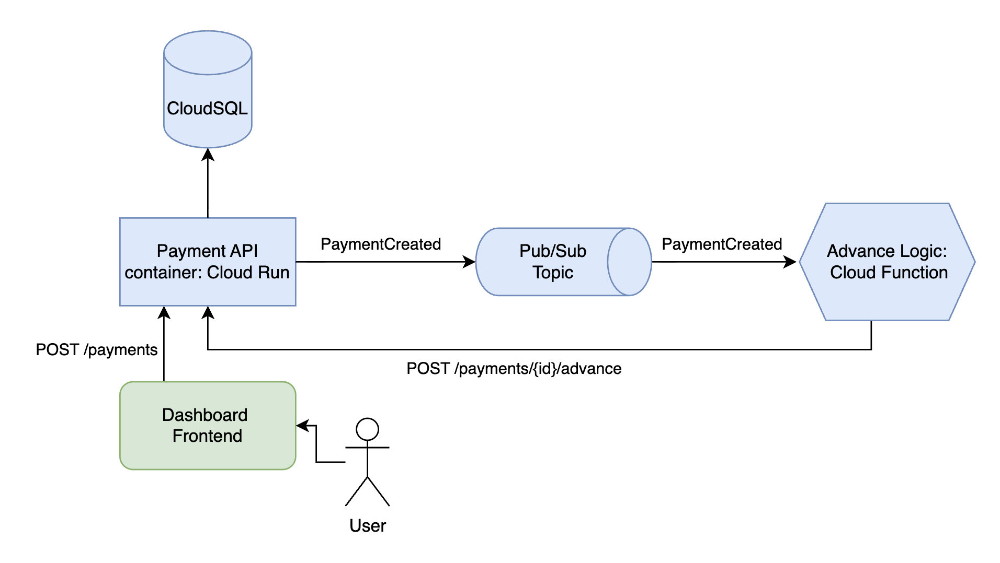

# Payment Core API

A Spring Boot service for managing payments. Exposes a REST API for creating, listing, and advancing payments. Persists to Cloud SQL (PostgreSQL) and publishes events to Google Cloud Pub/Sub. Designed to run on Cloud Run.

## Tech Stack

- **Java 21** / **Spring Boot 3.5**
- **Spring Data JPA** + **PostgreSQL** (Cloud SQL in production, H2 in tests)
- **Liquibase** for database migrations
- **Google Cloud Pub/Sub** for event publishing
- **SpringDoc OpenAPI** for API documentation

## Project Structure

```
src/main/java/com/impact/paymentcore/
├── controller/         REST endpoints
├── dto/                Request/response DTOs
├── exception/          Custom exceptions with HTTP status mapping
├── model/              JPA entities and enums
├── repository/         Spring Data repositories
└── service/            Business logic
```

## API Endpoints

| Method | Path                      | Description                          | Status  |
|--------|---------------------------|--------------------------------------|---------|
| GET    | `/payments`               | List all payments                    | 200     |
| POST   | `/payments`               | Create a new PENDING payment         | 201     |
| POST   | `/payments/{id}/advance`  | Advance a PENDING payment to ADVANCED| 200     |
| DELETE | `/payments`               | Delete all payments                  | 204     |

Swagger UI is available at `/swagger-ui.html` when the app is running.

## Environment Variables

| Variable              | Description                                          | Default                                     |
|-----------------------|------------------------------------------------------|---------------------------------------------|
| `SPRING_CLOUD_GCP_PROJECT_ID`| GCP project ID                                      | —                                           |
| `SPRING_CLOUD_GCP_SQL_INSTANCE_CONNECTION_NAME`  | Cloud SQL instance connection name                   | —                                           |
| `DB_NAME`             | Database name                                        | `payments`                                  |
| `DB_USER`             | Database user                                        | `postgres`                                  |
| `DB_PASSWORD`         | Database password                                    | —                                           |


## Running Locally

### Prerequisites

- Java 21
- A GCP project with Cloud SQL (PostgreSQL) and Pub/Sub provisioned
- `gcloud` CLI authenticated

### Authenticate

```bash
gcloud auth application-default login
```

### Run

```bash
SPRING_CLOUD_GCP_PROJECT_ID=your-project \
SPRING_CLOUD_GCP_SQL_INSTANCE_CONNECTION_NAME=your-project:europe-north1:your-instance \
DB_NAME=payments \
DB_USER=postgres \
DB_PASSWORD=secret \
./gradlew bootRun
```

The app starts on `http://localhost:8080`.

## Running Tests

Tests use an in-memory H2 database and mock Pub/Sub — no GCP credentials needed.

```bash
./gradlew test
```

## Database Migrations

Schema is managed by Liquibase. Migrations live in `src/main/resources/db/changelog/migrations/` and are applied automatically on startup.

To add a new migration, create a file in that directory and include it in `db.changelog-master.yaml`.

## Building entire project in GCP console

### Architecture

This repo, while built and deployed as a single Payments API container, contains all the code necessary to run a larger demo project in GCP. The architecture connects an Advance Logic service to a Payment API, simulating a small advance product team spinning up independently within a larger fintech monolith — building out advance functionality as a separate, event-driven service rather than adding to the existing codebase.



The system consists of four components working together:

1. **Dashboard Frontend** ([`/dashboard`](dashboard)) — A local web app where users create and manage payments. It sends `POST /payments` requests to the Cloud Run API.
2. **Payment Core API (Cloud Run)** ([`/src`](src)) — A Spring Boot service that receives payment requests, persists them to **Cloud SQL** (PostgreSQL) with a `PENDING` status, and publishes a `PaymentCreated` event to a **Pub/Sub** topic.
3. **Pub/Sub Topic** — Acts as the message broker between the API and the Cloud Function. When a new payment is created, the `PaymentCreated` event is delivered to all subscribers.
4. **Advance Logic Cloud Function** ([`/cloud_function`](cloud_function)) — A Java Cloud Function triggered by the Pub/Sub `PaymentCreated` event. It calls `POST /payments/{id}/advance` back on the Cloud Run API to advance the payment from `PENDING` to `ADVANCED` if the payment meets certain criteria.

This event-driven design decouples payment creation from the advance logic, allowing each component to scale independently and making it straightforward to add additional subscribers to the Pub/Sub topic in the future.

### Steps

1. Navigate to IAM and create a service account for the payments API
2. Navigate to CloudSQL and create a Postgres database with a username and a password
   - Give the service account the role `CloudSQL Client` for this DB
3. Create a Pub/Sub topic with name `new-payment-topic`
   - Give the service account the role `Pub/Sub Publisher` on this topic
4. Fork this repository into your own github account
5. Navigate to Cloud Run > Deploy a Webservice > Connect Repository and choose the fork
   - Chose sensible config
   - Add our CloudSQL DB in the CloudSQL Connections dropdown
   - Pass in the envs as described in this readme
6. Once this API is successfully deployed, navigate to Cloud Run > Write a function > Java
   - Add trigger (Pub/Sub), chose the topic we created
   - Paste the java from the [`/cloud_function`](cloud_function) folder in this repo
7. Once cloud function is successfully deployed, run `npm i & npm run dev` inside of the [`/dashboard`](dashboard) folder

